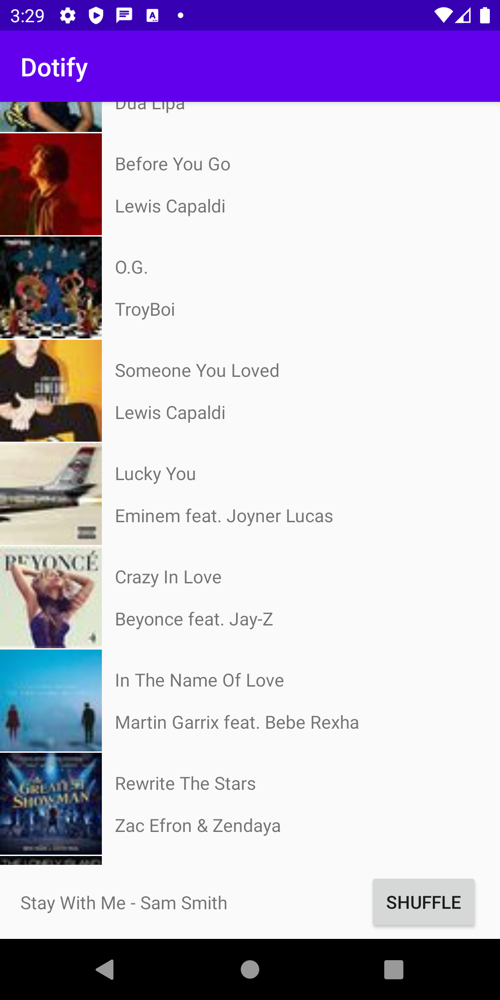
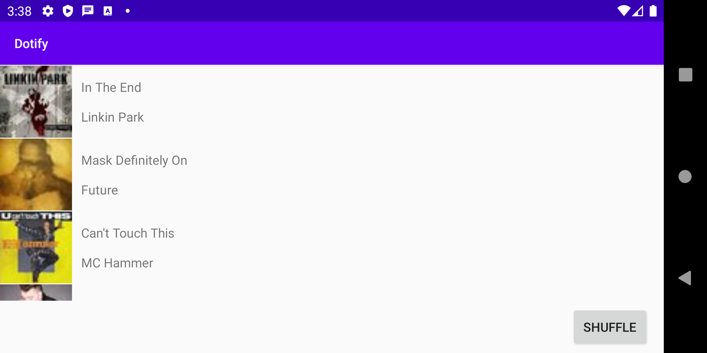
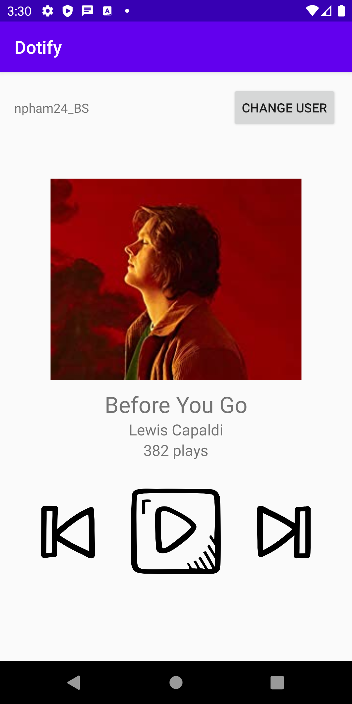

# INFO 448 Assignment 3, Dotify
## By Nam Pham

This application is a rip off mock application of a music player that cannot even play music, refactored using Fragments!. Starting the app will show a randomized list of songs, and upon clicking on one song it takes you to the specific song view

You can click on the Play button to increase your play count.

Screenshot:

Music list:

Music list (landscape):

Specific song:

